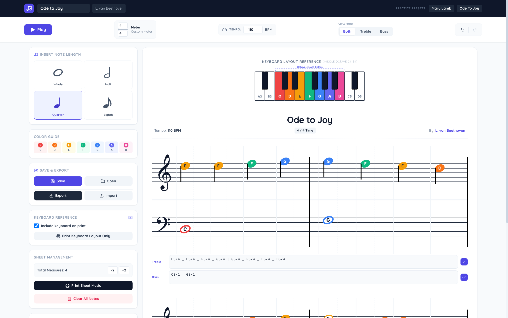

# Piano Sheet Music Creator 🎹 🎼
A simple, reactive app to create color-coded piano sheet music for teaching new students.

Access the app: [**Piano Sheet Music Creator**](https://rparkr.github.io/piano-sheet-music-creator/)

How I created this app

> Originally created with Gemini Canvas using Gemini 3.5 Flash. I've since made refinements and added features using other models; mostly [DeepSeek V4 Flash](https://huggingface.co/deepseek-ai/DeepSeek-V4-Flash-0731) in [OpenCode](https://github.com/anomalyco/opencode) and Gemini 3.6 Flash in the [Antigravity CLI](https://antigravity.google/download).
> 
> Aside from some manual tweaks I have made, I used AI coding agents to write the majority of the code for this application.

 

# Goals
**Fast and easy to use**  
Users can create sheet music quickly, with intuitive controls that work great on a smartphone. Play back the composition to hear how it sounds before printing it.

**Printing fidelity**  
A nice layout when printed, following as closely as possible the style of professional sheet music, with simplifications intended to benefit beginning pianists.

**100% Client-side, offline**  
After loading, the app works without internet access -- all processing happens on your device.

# Usage
- Click or tap on the staff to add notes (or type them in the input below each staff)
- Tap and hold a note to remove it or to change the pitch, move to a different beat, or adjust the accidental (flat or sharp)
- Set the title, composer, meter, and beats per minute using the controls at the top
- Tap "Play" to listen to the score
- Tap "Save" to save the current score. Saving a score with the same name updates it.
- Tap "Open" to load a saved score
- Tap "Export" to download a copy of the score as JSON, which you can later import
- Tap "Print Sheet Music" to print the score or save it as a PDF

# Features
- Mobile-first responsive design that works great on larger displays as well
- Edits are saved automatically and persist when you close and re-open the browser so you can resume where you left off
- Save and load from local storage
- Export and import for sharing sheet music
- Play the score to preview it
- Print easily

# Screenshots
_Widescreen layout_

---

_Smartphone layout_

